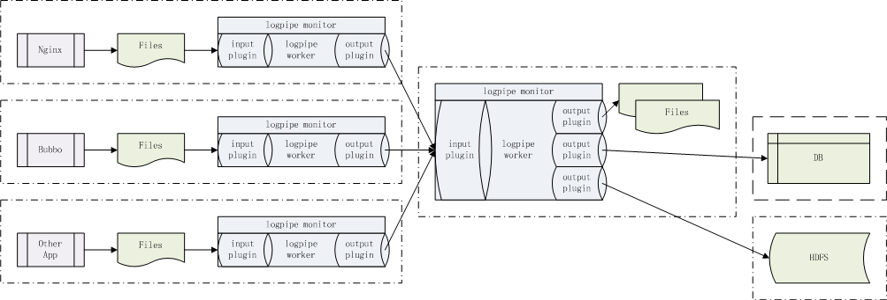

日志采集工具(logpipe)
====================
<!-- TOC -->

- [1. 概述](#1-概述)
- [2. 安装](#2-安装)
    - [2.1. 源码编译安装](#21-源码编译安装)
        - [2.1.1. 编译安装logpipe](#211-编译安装logpipe)
        - [2.1.2. 编译安装自带logpipe插件](#212-编译安装自带logpipe插件)
        - [2.1.3. 确认安装](#213-确认安装)
- [3. 使用](#3-使用)
- [4. 插件开发](#4-插件开发)
- [5. 性能压测](#5-性能压测)
- [6. 最后](#6-最后)

<!-- /TOC -->
# 1. 概述

在集群化环境里，日志采集是重要基础设施。

开源主流解决方案是基于flume-ng，但在实际使用中发现flume-ng存在诸多问题，比如flume-ng的spoolDir采集器只能对文件名转档后的大小不能变化的最终日志文件进行采集，不能满足采集时效性要求，如果要采集正在被不断追加的日志文件，只能用exec采集器搭配tail -F命令，但tail -F命令又不能通配目标目录中将来新增的未知文件名。其它解决方案如logstash由于是JAVA开发，内存占用和性能都不能达到最优。

作为一个日志采集的本地代理，内存占用应该小而受控，性能应该高效，耗费CPU低对应用影响尽可能小，要能异步实时追踪日志文件增长，某些应用会在目标目录下产生多个日志文件甚至现在不能确定将来的日志文件名，架构上要支持多输入多输出流式日志采集传输，为了达成以上需求，我研究了所需技术，评估实现难度并不高，就自研了logpipe。

logpipe是一个分布式、高可用的用于采集、传输、对接落地的日志工具，采用了插件风格的框架结构设计，支持多输入多输出按需配置组件用于流式日志收集架构。



logpipe概念朴实、使用方便、配置简练，没有如sink等一大堆新名词。

logpipe由若干个input、事件总线和若干个output组成。启动logpipe管理进程(monitor)，派生一个工作进程(worker)，监控工作进程崩溃则重启工作进程。工作进程装载配置加载若干个input插件和若干个output插件，进入事件循环，任一input插件产生消息后输出给所有output插件。

logpipe自带了4个插件（今后将开发更多插件），分别是：
* logpipe-input-file 用inotify异步实时监控日志目录，一旦有文件新建或文件增长，立即捕获文件名和读取文件追加数据。拥有文件大小转档功能，用以替代应用日志库对应功能，提高应用日志库写日志性能。支持数据压缩。
* logpipe-output-file 一旦输入插件有消息产生后用相同的文件名落地文件数据。支持数据解压。
* logpipe-input-tcp 创建TCP服务侦听端，接收客户端连接，一旦客户端连接上有新消息到来，立即读取。
* logpipe-output-tcp 创建TCP客户端，连接服务端，一旦输入插件有消息产生后输出到该连接。

使用者可根据自身需求，按照插件开发规范，开发定制插件，如IBMMQ输入插件、HDFS输出插件等。

logpipe配置采用JSON格式，层次分明，编写简洁，如示例：

```
{
	"log" : 
	{
		"log_file" : "/tmp/logpipe_case1_collector.log" ,
		"log_level" : "INFO"
	} ,
	
	"inputs" : 
	[
		{ "plugin":"so/logpipe-input-file.so" , "path":"/home/calvin/log" , "compress_algorithm":"deflate" }
	] ,
	
	"outputs" : 
	[
		{ "plugin":"so/logpipe-output-tcp.so" , "ip":"127.0.0.1" , "port":10101 }
	]
}

```

# 2. 安装

## 2.1. 源码编译安装

### 2.1.1. 编译安装logpipe

从[开源中国](https://gitee.com/calvinwilliams/logpipe)或[github](https://github.com/calvinwilliams/logpipe)克隆或下载最新源码包，放到你的源码编译目录中解开。以下假设你的操作系统是Linux：

进入`src`目录，编译得到可执行程序`logpipe`和动态库`liblogpipe_api.so`。

```
$ cd src
$ make -f makefile.Linux
gcc -g -fPIC -O2 -Wall -Werror -fno-strict-aliasing -I. -I/home/calvin/include -std=gnu99  -c list.c
gcc -g -fPIC -O2 -Wall -Werror -fno-strict-aliasing -I. -I/home/calvin/include -std=gnu99  -c rbtree.c
gcc -g -fPIC -O2 -Wall -Werror -fno-strict-aliasing -I. -I/home/calvin/include -std=gnu99  -c fasterjson.c
gcc -g -fPIC -O2 -Wall -Werror -fno-strict-aliasing -I. -I/home/calvin/include -std=gnu99  -c LOGC.c
gcc -g -fPIC -O2 -Wall -Werror -fno-strict-aliasing -I. -I/home/calvin/include -std=gnu99  -c config.c
gcc -g -fPIC -O2 -Wall -Werror -fno-strict-aliasing -I. -I/home/calvin/include -std=gnu99  -c env.c
gcc -g -fPIC -O2 -Wall -Werror -fno-strict-aliasing -I. -I/home/calvin/include -std=gnu99  -c util.c
gcc -g -fPIC -O2 -Wall -Werror -fno-strict-aliasing -I. -I/home/calvin/include -std=gnu99  -c output.c
gcc -g -fPIC -O2 -Wall -Werror -fno-strict-aliasing -o liblogpipe_api.so list.o rbtree.o fasterjson.o LOGC.o config.o env.o util.o output.o -shared -L. -L/home/calvin/lib -rdynamic -ldl -lz 
gcc -g -fPIC -O2 -Wall -Werror -fno-strict-aliasing -I. -I/home/calvin/include -std=gnu99  -c main.c
gcc -g -fPIC -O2 -Wall -Werror -fno-strict-aliasing -I. -I/home/calvin/include -std=gnu99  -c monitor.c
gcc -g -fPIC -O2 -Wall -Werror -fno-strict-aliasing -I. -I/home/calvin/include -std=gnu99  -c worker.c
gcc -g -fPIC -O2 -Wall -Werror -fno-strict-aliasing -o logpipe main.o monitor.o worker.o -L. -L/home/calvin/lib -rdynamic -ldl -lz  -llogpipe_api
```

可执行程序logpipe就是日志采集本地代理，动态库liblogpipe_api.so给插件开发用。

然后安装编译目标，默认`logpipe`安装到`$HOME/bin`、`liblogpipe_api.so`安装到`$HOME/lib`、`logpipe_api.h`等一些头文件安装到`$HOME/include/logpipe`，如果需要改变安装目录，修改`makeinstall`里的`_HDERINST`、`_LIBINST`和`_BININST`。

```
$ make -f makefile.Linux install
rm -f /home/calvin/bin/logpipe
cp -rf logpipe /home/calvin/bin/
rm -f /home/calvin/lib/liblogpipe_api.so
cp -rf liblogpipe_api.so /home/calvin/lib/
rm -f /home/calvin/include/logpipe/rbtree.h
cp -rf rbtree.h /home/calvin/include/logpipe/
rm -f /home/calvin/include/logpipe/LOGC.h
cp -rf LOGC.h /home/calvin/include/logpipe/
rm -f /home/calvin/include/logpipe/fasterjson.h
cp -rf fasterjson.h /home/calvin/include/logpipe/
rm -f /home/calvin/include/logpipe/rbtree_tpl.h
cp -rf rbtree_tpl.h /home/calvin/include/logpipe/
rm -f /home/calvin/include/logpipe/logpipe_api.h
cp -rf logpipe_api.h /home/calvin/include/logpipe/
```

### 2.1.2. 编译安装自带logpipe插件

进入`src`同级的`src-plugins`，编译插件

```
$ cd ../src-plugins
$ make -f makefile.Linux 
gcc -g -fPIC -O2 -Wall -Werror -fno-strict-aliasing -I. -I/home/calvin/include -std=gnu99 -I/home/calvin/include/logpipe  -c logpipe-input-file.c
gcc -g -fPIC -O2 -Wall -Werror -fno-strict-aliasing -o logpipe-input-file.so logpipe-input-file.o -shared -L. -L/home/calvin/so -L/home/calvin/lib -llogpipe_api -rdynamic 
gcc -g -fPIC -O2 -Wall -Werror -fno-strict-aliasing -I. -I/home/calvin/include -std=gnu99 -I/home/calvin/include/logpipe  -c logpipe-output-file.c
gcc -g -fPIC -O2 -Wall -Werror -fno-strict-aliasing -o logpipe-output-file.so logpipe-output-file.o -shared -L. -L/home/calvin/so -L/home/calvin/lib -llogpipe_api -rdynamic 
gcc -g -fPIC -O2 -Wall -Werror -fno-strict-aliasing -I. -I/home/calvin/include -std=gnu99 -I/home/calvin/include/logpipe  -c logpipe-input-tcp.c
gcc -g -fPIC -O2 -Wall -Werror -fno-strict-aliasing -o logpipe-input-tcp.so logpipe-input-tcp.o -shared -L. -L/home/calvin/so -L/home/calvin/lib -llogpipe_api -rdynamic 
gcc -g -fPIC -O2 -Wall -Werror -fno-strict-aliasing -I. -I/home/calvin/include -std=gnu99 -I/home/calvin/include/logpipe  -c logpipe-output-tcp.c
gcc -g -fPIC -O2 -Wall -Werror -fno-strict-aliasing -o logpipe-output-tcp.so logpipe-output-tcp.o -shared -L. -L/home/calvin/so -L/home/calvin/lib -llogpipe_api -rdynamic 
```

然后安装编译目标，默认自带插件安装到`$HOME/so`，如果需要改变安装目录，修改`makeinstall`里的`_LIBINST`。

```
$ make -f makefile.Linux install
rm -f /home/calvin/so/logpipe-input-file.so
cp -rf logpipe-input-file.so /home/calvin/so/
rm -f /home/calvin/so/logpipe-output-file.so
cp -rf logpipe-output-file.so /home/calvin/so/
rm -f /home/calvin/so/logpipe-input-tcp.so
cp -rf logpipe-input-tcp.so /home/calvin/so/
rm -f /home/calvin/so/logpipe-output-tcp.so
cp -rf logpipe-output-tcp.so /home/calvin/so/
```

### 2.1.3. 确认安装

确认`$HOME/bin`已经加入到`$PATH`中，不带参数执行`logpipe`，输出以下信息表示源码编译安装成功

```
$ logpipe
USAGE : logpipe -v
        logpipe -f (config_file) [ --no-daemon ] [ --start-once-for-env "(key) (value)" ]
```

用参数`-v`可以查看当前版本号

```
$ logpipe -v
logpipe v0.7.0 build Dec 17 2017 20:02:46
```

# 3. 使用


# 4. 插件开发


# 5. 性能压测


# 6. 最后
